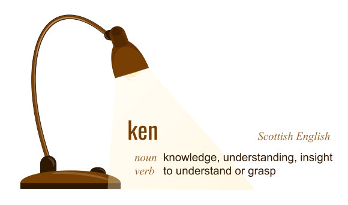

# ken

Ken is a variant of markdown that maximizes expressive power.

Ken's syntax derives from [Github-Flavored Markdown](https://github.github.com/gfm/) (which in derives from [CommonMark](https://spec.commonmark.org/)). If you know markdown, you already know most of ken. Read [the spec](spec/README.md) for details.

#### Why

Do we need another syntax?

Regular markdown (a high-level *writing* format) prioritizes the goal of authoring content that is readable as plaintext, and transforming it into HTML (a lower-level, more powerful *publishing* format) that can display safely inside a containing website. It's great if simplicity is your overriding concern.

But heavy users of markdown hit limits. *Can I use colors? How do I make footnotes? Can I put multi-line content in a table? Is there any way to tweak the CSS?* Markdown's answer is to [use inline HTML for advanced constructs](https://daringfireball.net/projects/markdown/syntax#html). But this is problematic. Because markdown is meant to be render inside a web site container, its implementations must sanitize many HTML constructs to prevent [cross-site scripting (XSS)](https://owasp.org/www-community/attacks/xss/#) and [scriptless attacks](https://citeseerx.ist.psu.edu/viewdoc/download?doi=10.1.1.469.7647&rep=rep1&type=pdf). These are the very constructs that make HTML so beautiful, expressive, and responsive (CSS, `<style>`, `<script>`, various HTML tag attributes, etc.).

Writing HTML directly is an option, of course. But that's not just a bother or a learning curve &mdash; it's a strategy incompatible with static website generators and embedded wiki pages. It's like asking programmers to drop into low-level assembly language just because they want to write subroutines.

Ken is still a high-level *writing* format. It still generates HTML, and it can be used with static site generators. But unlike regular markdown, it prioritizes expressive power and standalone documents more highly. It has more options for advanced users. And instead of mandating the sanitization of dangerous HTML elements, it defines choices for [transforming](../glossary.html#iml-transformation) in [embeddable mode](../glossary.html#embeddable-mode), [standalone mode](../glossary.html#standalone-mode), or [natural mode](../glossary.html#natural-mode). This preserves safety where it is needed, but allows more nuanced output.

Ken also introduces some structural semantics that go beyond what vanilla HTML can model. These constructs are typically built into web pages with a combination of CSS and JavaScript; in ken, you can write them directly without worrying about implementation details.
