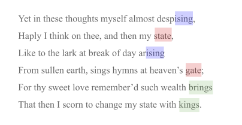

asides with {} on line by itself, outdented; possibly identify or stylize the asides after opening bracket
special convention: single letter ids resets with every paragraph (not a disjoint anchor)
spans: not for hyperlinking but for connecting, underlining, etc: [- highlighted text] or [_ underlined text] or [| boxed text] (default color = gray); also [-red- text] or [_red_ text] or [|red| text]
footnotes with [#a: referencing text] and [a:] explanatory note
multiple footnotes on the same referencing text: [#a,b: referencing text]
paragraph numbers with 1- instead of 1.
autonumber list/paragraph with 0. and 0-; otherwise manually numbered
list styles a.

## Hypertext

ken is an extremely powerful hypertext format. For clarity and ease of use, it supports most hypertext features from pure markdown and from [many of markdown's variants](https://gist.github.com/vimtaai/99f8c89e7d3d02a362117284684baa0f). It also plugs gaps where markdown omits an HTML feature (e.g., the ability to specify a `target` for a link). And it even goes beyond HTML, offering [highlights](highlights.md), [comments, footnotes, and endnotes](asides.md) like a word processor, [definition links like ReSpec](https://respec.org/docs/#definitions-and-linking), plus a few hypertext constructs that are totally unique.

### Quick Reference

element | syntax
--- | ---
[normal hyperlink](#hyperlinks) | As in standard markdown: `[clickable content](ref)`. Advanced params can be added after `ref` but before the closing paren, using <code>&vert;</code> and `a=b; x=y` syntax: <code>[clickable content](ref&vert; download=license.txt; rel=license)</code>. Whitespace before and after the <code>&vert;</code> and `;` characters are optional.
[terse hyperlink](#terse-hyperlinks) | `[#clickable content]`, where the clickable content [derives the ID](#comparing-anchor-ids) of an anchor elsewhere. The `#` character is not rendered.
autolinks | Tokens that match URI syntax and that begin with `http://`, `https://`, and `mailto:` are automatically rendered as hyperlinks by ken, unless they are immediately preceded by empty braces, as in `[]http://example.com/dont-make-me-clickable`.
[simple text anchor](#simple-text-anchors) | `[anchor text]`. ID is [derived from](#comparing-anchor-ids) anchor text. Unlike HTML or markdown, ken allows nested anchors (e.g., where a full sentence is an anchor, a word inside the sentence can also be an anchor).
[anchor with explicit ID](#explicit-anchor-ids) | `[@id: anchor text]`. Only `anchor text` is rendered.
[hidden or empty anchors](#hidden-or-empty-anchors) | `[@id:]` (nothing is rendered)
[headers as anchors](#headers-as-anchors) | Same as markdown: `# My header` becomes an anchor referencable as `#my-header`. The space after `#` is required in the header. Unlike markdown, ken allows the ID for a header to be overridden by inserting an explicit ID at the beginning of the header's content: `# [@short-id:]My unwieldy header (and humorous aside)`.
[definition anchor](#definition-text-anchors) | `[=term with definition in surrounding paragraph]`. For compatibility with other markdown variants, the close bracket may be preceded by an equals sign: `[=term=]`, though this form is deprecated. Typically referenced with a [terse hyperlink](#terse-hyperlinks).
[code anchors in IPL](#code-anchors) | Automatic from structure; referenced with dotted notation.
[anchors for media and other complex content](#anchor-pairs) | `[@id ...]content[/]`. Unlike HTML, overlapping anchors are legal, with some caveats.
[disjoint anchors](#disjoint-anchors) | Use the same ID more than once. Add a `+` after at least one instance of the repeated explicit ID to clarify that this is intentional: `[@id+:anchor text]` and/or `[@id+ ...]content[/]`. All content with the same ID becomes part of a single disjoint anchor.

### Anchors

An anchor is a target for a hyperlink -- something we can point *at*. It may be a word or phrase, a location, a visual artifact, or any other type of ken content.

#### Simple text anchors

The most common thing to point at in ken is text, and the simplest way to make it a pointable target is to enclose it in square brackets. For example, the following paragraph defines anchors around "Magnetic resonance imaging" and "MRI", so they can be referenced elsewhere:

```ken
[Magnetic resonance imaging] ([MRI]) is a medical imaging
technique used in radiology to form pictures of the anatomy
and the physiological processes of the body.
```

__Anchor text__ is intended to be visualized inline with the text that surrounds it -- probably un-stylized, and certainly without the square brackets. Enclosing it in square brackets simply delimits the region of the text that can be pointed to:


#### Anchor IDs

Each anchor defines one (or more) __anchor IDs__ -- a short, memorable string that uniquely identifies the anchor within its container.

##### Implicit anchor IDs

The easiest way to define the ID of an anchor is to leave it implicit -- let it be calculated automatically from the anchor text itself. This is what happens with the simple square bracket notation in the MRI example above; the ID for "MRI" is "MRI", too. Or close enough. (See [Comparing anchor IDs below](#comparing-anchor-ids) for more details.)

##### Explicit anchor IDs

It is also possible to customize the ID for an anchor using a more verbose __explicit ID syntax__: `[+id: anchor text]`. For example, the following ken defines a short ID instead of the one that would have been derived from a longer phrase:

```i
The [+ww2history: history of World War II] is long and complex.
```

The `+id:` prefix can also be prepended to the bracketed data inside normal or terse hyperlinks, making the hyperlinks anchors even as they point elsewhere. This can be useful in endnotes.

##### ID variants

The same anchor can have multiple ID variants; see [Definition Anchors &gt; Inflection](#inflection) for an example use case and syntax.

##### Comparing anchor IDs

Whether anchor IDs are implicit or explicit, ken recognizes and compares them in a way that makes them convenient and robust for humans who might capitalize, space, or punctuate inconsistently. Minor details are ignored: ID values are trimmed, converted to lower case, and have all runs of punctuation and/or spaces replaced with a single hyphen. This means that the anchor id `MRI` could also be written as `mri`. And this contrived example of a really messy ID:

    He won't -- or shouldn't, anyway! -- say "Get lost."

...is the same as:

    he-won-t-or-shouldn-t-anyway-say-get-lost

The lower kabob-case form is canonical and preferred. However, variants of this ID that are just capitalized or punctuated differently will also be seen as equivalent.

In addition, *references* to IDs can be abbreviated with an `*` wildcard, as long as the portion of the ID that remains is unambiguous. In most containers, the long ID above could probably be referenced as `He won't*` or `* say 'Get lost'` or even `he*get-lost`. This lets IDs be as long as is natural -- but lets references be much terser.

#### Hidden or empty anchors

Sometimes the intent is to anchor a *location*, rather than anchoring *visible content*. For example, you might want to point between two words to show someone where a missing piece of content belongs. To do this, simply insert an explicit anchor ID without any anchor text:

```i
running text[insert-here:] and more and more words
```

Note the lack of a space after "text". The anchor is for an insert point immediately after "text". If we had instead written:

```i
running text [insert-here:] and more and more words
```

...the anchor would be between two spaces.

#### Definition anchors and references

In legal and technical documents, it's common to define terms. Often, this is done in the running text of a paragraph. Instances of the term in other places in the doc can then link back to its definition, helping readers who forget the details or consume the content out of order.

Definition anchors in ken facilitate this pattern. They resemble the behavior of `<def>` tags in ReSpec. Where a term is defined, use `[=defined term]` to create an anchor. Where it is referenced, usually [terse link](#terse-links) syntax is optimal: `[#defined term]`.

In the example text about MRIs that we showed above, it might make sense to upgrade to definition anchors, since the paragraph in question actually does provide a definition. The result would look like this:

```ken
[=Magnetic resonance imaging] ([=MRI]) is a medical imaging
technique used in radiology to form pictures of the anatomy
and the physiological processes of the body.
```

Later in the document, we'd reference such a definition this way:

```ken
In certain circumstances, an [#MRI] provides diagnostic insight that is unavailable with a CAT scan. 
```

##### Inflection

But what if we wanted to make our term reference plural: "MRIs provide diagnostic insight..."? Now our clickable term ends with `-s`, whereas its definition is the uninflected singular form... There are two solutions: 

* Add __ID variants__ to the anchor: In the definition anchor, do something like this: `[id:MRIs: MRI]`. ken treats everything will render only the first form in the *in situ* context, but will accept all others as equally valid variants in references. Variants can include the `*` wildcard; `[=invoking|invoc*|invok*]` creates ID variants that match any form of the verb `invoke`.

    >Note 1: It also creates some nonsense possibilities like accidentally mapping `[#invoc-o-matic]` to the `invoc*` anchor -- but since the author chooses whether to insert such references, and since definition references can only point at definition anchors, there's little practical difficulty with the fuzzy target.

    >Note 2: ID variants are not currently supported for anything except definition anchors. Perhaps they will be supported elsewhere in the future. 

>   >Note 3: This syntax does not allow the pipe character to be part of the  

* Just use a traditional hyperlink in the `[clickable text](#id)` form:

    ```ken
    In certain circumstances, [MRIs](#mri) provide diagnostic 
    insight that is unavailable with a CAT scan. 
    ```

#### Code anchors

The structure of [IPL](../glossary#ken-programming-language) source code automatically creates anchors. All formally assigned identifiers (block headers that end in a colon and are followed by indented content) in ken are anchored to their place of definition. In this code:

```i
Register to vote: bool
    params:
        voter
        election
    code:
        # code goes here
```

...the name `Register to vote` is an anchor. So is `Register to vote.params` and `Register to vote.code`.

#### Advanced anchors

Pointing at a simple word or phrase is relatively easy -- but ken supports more sophisticated constructs as well.

##### Anchor pairs

When anchors encompass content that is non-textual, large, or complex, an __anchor pair__ can be used. This is somewhat like a begin tag/end tag pair in HTML. The __anchor start__ contains the anchor ID followed by whitespace and an ellipsis. The __anchor end__ is another bracketed expression that contains the anchor ID preceded by slash:

```i
Sonnet 29 is a famous romantic poem by Shakespeare. 
It goes like this:

    [sonnet-29 ...]
    (all the text of the poem)
    [/sonnet-29]
```

The anchor end only needs enough of the ID from the anchor start to be unambiguous. Often, this could simplify all the way to:

```i
    [sonnet-29 ...]
    (all the text of the poem)
    [/]
```

##### Overlapping anchors

Unlike HTML, anchors in ken do not need to nest cleanly; they can overlap. The following is legal ken code, but requires anchor pairs with at least partial IDs in the anchor ends to make the intent clear:


##### Disjoint anchors

ken also supports anchors that encompass multiple, separate stretches of content as a single composite unit. For example, suppose an English teacher wants to illustrate the rhyme scheme in Shakespeare's sonnet. She might define the endings of rhyming lines to be part of a single __disjoint anchor__. When she later links to such an anchor, she is able to point to all items that share a common anchor ID as a unit. In the following example, she could point to the red lines, the blue lines, or the green lines as link targets:



To define disjoint anchors in ken, use any anchor style(s) with an explicit id, and append a `+` char to at least one instance of the shared anchor ID:

```i
Yet in these thoughts myself almost desp[a+:ising],
Haply I think on thee, and then my [b+ ...]state[/],
Like to the lark at break of day ar[a ...]ising[/]
From sullen earth, sings hymns at heaven’s [b:gate];
For thy sweet love remember’d such wealth [c:brings]
That then I scorn to change my state with [c+:kings].
```

### Hyperlinks

A hyperlink is an expression in the form `[+id: clickable content](ref)`, where `+id: ` is optional and has the same semantics as with anchors (allowing a hyperlink to also be an anchor itself), `ref` is an ID defined elsewhere, and `clickable content` is the text or graphic that would be rendered as blue underlined text if the hyperlink were HTML. Additional params--`target` and `base`--can be added between `anchor` and `linked text` using `;` + whitespace, as in:

```i
[clickable text](https://www.example.com/a/b; target=_blank; rel=author)
```

The expression in the parenthesized portion of the hyperlink can be any relative or absolute URI, including a document fragment like `#fragment`).

#### Terse Hyperlinks
Imagine that, somewhere near the end of our imaginary ken document about MRIs, we include the following sentence that refers back to the place where our term was defined:

```i
[Magnetic resonance imaging](#magnetic-resonance-imaging) is often expensive.
```

This works -- but notice how verbose it is. For situations like this, we take advantage of ken's support for fuzzy ID matching, and write a terse form instead:

```i
[#Magnetic resonance imaging] is often expensive.
```  

This combines the referenced ID and the clickable text, making the parenthesized portion of the hyperlink unnecessary. ken normalizes the bracketed phrase to `magnetic-resonance-imaging` to resolve the hyperlink.

Terse hyperlink are both easier to write and easier to read. Their use is encouraged, where they make sense.

#### Paired Hyperlinks
Hyperlinks also support a paired variant that follows the same rules as anchors:

```i
[](@https://a.b.com/c; target=_blank ...)clickable content[/] 
```

...or:

```i
[+id:x](https://a.b.com/c; target=_blank ...)clickcable content[/x]
```


